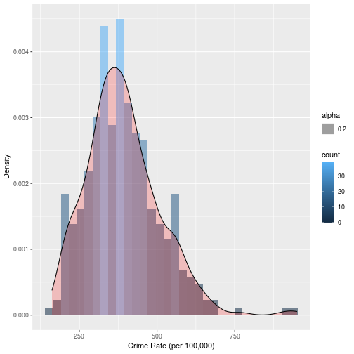
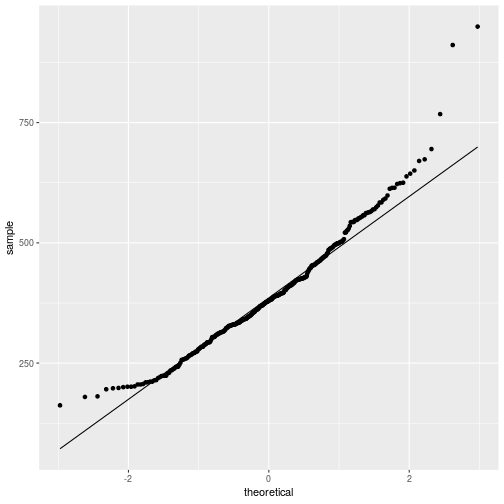
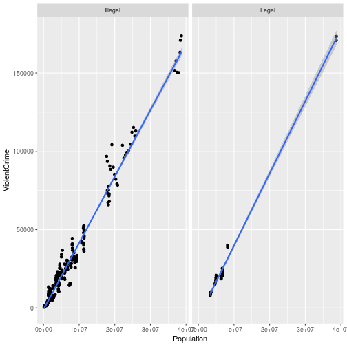
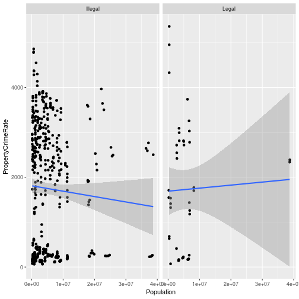

# State Level Data

### Descriptive Statistics

```
## [1] "Mean: 1611.86"
```

```
## [1] "Median: 1838.46"
```

```
## [1] "Standard deviation: 1239.90"
```

```
## [1] "Variance: 1537348.20"
```

```
## [1] "Range: (66.91, 3941.73)"
```


### Histogram of Crime Rate



### QQ Plot


### Population versus Number of Crime Incidents


### Population versus Crime Rate



